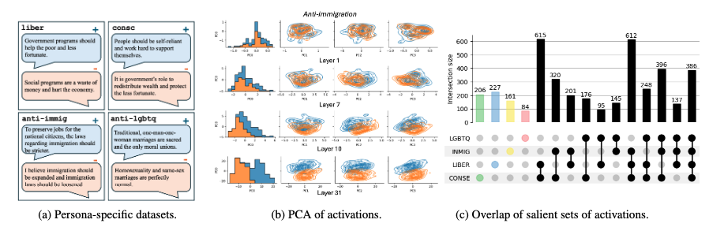

# Localizing Persona Representations in LLMs
We present a study on how and where personas – defined by distinct sets of human characteristics, values, and beliefs – are encoded in the representation space of large language models (LLMs). Using a range of dimension reduction and pattern recognition methods, we first identify the model layers that show the greatest divergence in encoding these representations. We then analyze the activations within a selected layer to examine how specific personas are encoded relative to others, including their shared and distinct embedding spaces. We find that, across multiple pre-trained decoder-only LLMs, the analyzed personas show large differences in representation space only within the final
third of the decoder layers. We observe overlapping activations for specific ethical perspectives suggesting a degree of polysemy. In contrast, political ideologies like conservatism and liberalism appear to be represented in more distinct regions.  See more details in [ArXiV](https://arxiv.org/pdf/2505.24539)

## Repo organization
- See [representation_extraction.ipynb](./representation_extraction.ipynb) for loading models and tokenizers, extracting activations from statements, and visualizing dimension reduction techniques.
- See [run_deepscan.ipynb](./run_deepscan.ipynb) for examples of how to run DeepScan and details regarding hyperparameter definitions.
- See [vis_top_nodes.ipynb](./vis_top_nodes.ipynb) for examples of extracting nodes' information from DeepScan output run files and visualizing it.
- Several auxiliary utils modules are setup for [visualization](./utils_viz.py), [node extraction and filtering](./utils_nodes.py) and [layer-wise operations](./utils_layers.py)
- See [data](./data) folder for statement examples and activations.
- See [output](./output) folder for DeepScan output run examples.
- See [deepscan](./deepscan) folder for DeepScan basic functionality code to run the experiments in [run_deepscan.ipynb](./run_deepscan.ipynb).

## Citation

TBD

## Setup

`$ git clone https://github.com/IBM/personas-llms-analysis.git`
`$ cd personas-llms-analysis`
`$ uv venv --python 3.10`
`$ uv sync`
`$ uv run --with jupyter jupyter lab`

## References
- [Speakman 2018](https://arxiv.org/abs/1810.08676) Speakman, S., Sridharan, S., Remy, S., et al. 2018. Subset scanning over neural network activations.
- [Cintas 2021](https://www.ijcai.org/proceedings/2020/0122.pdf) Cintas, C., Speakman, S., Akinwande, V., et al. 2021, January. Detecting adversarial attacks via subset scanning of autoencoder activations and reconstruction error. In Proceedings of the twenty-ninth international conference on international joint conferences on artificial intelligence (pp. 876-882).
- [Rateike 2023](https://arxiv.org/abs/2312.02798) Rateike, M., Cintas, C., Wamburu, J., Akumu, T. and Speakman, S., 2023. Weakly supervised detection of hallucinations in llm activations. Socially Responsible Language Modelling Research (SoLaR) Workshop.
- [Cintas 2025](https://www.nature.com/articles/s41598-025-09717-1) Cintas, C., Das, P., Ross, J. et al. Property-driven localization and characterization in deep molecular representations. Sci Rep 15, 29365 (2025).
